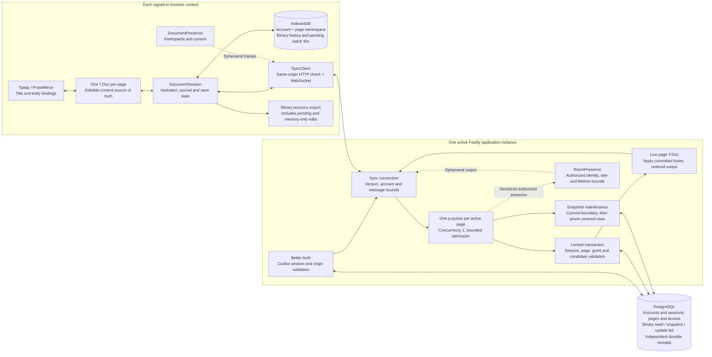

# Architecture and edit flow

Source checkpoint: 2026-10-07, including permanent deletion, binary snapshot compaction and recovery import. This describes the local implementation; the recorded hosted build remains `d9de585`, with database schema 4. Local source requires database schema 7, document schema 2 and wire protocol 2. See [verification](verification.md) for dated evidence and [the v1 checklist](v1-release.md) for remaining release gates.

## Responsibilities and trust boundaries



The HTTP page-session check and WebSocket handshake bind the mounted account/page to a real session. A page ID or cached account hint grants no permission. The write transaction independently locks and validates the active session, non-deleted page and owner/editor grant. Ownership, invitations and session credentials stay outside the collaborative document. The development fixture is a separate, explicitly enabled local identity, and cannot satisfy the authenticated release gate.

Presence uses the same socket and page authorization, with bounded serialized room operations, but never enters the document journal, update table, receipt flow or snapshots. Its participant identity comes from the authenticated server principal; motion is ephemeral and can be dropped. Presence reconnect obtains a fresh awareness snapshot.

## One edit, two durability boundaries

```mermaid
sequenceDiagram
  participant E as Editor / browser Y.Doc
  participant S as DocumentSession
  participant L as IndexedDB
  participant C as SyncClient
  participant Q as Server page queue / room
  participant D as PostgreSQL
  participant P as Authorized peer
  Note over E,S: Hydrate cache or committed server state before mounting editable content
  E->>S: Immediate local binary update
  S->>L: Transaction: update bytes + stable pending batch ID
  L-->>S: Local transaction committed
  S->>C: Next pending batch (one in flight)
  C->>Q: update(batchId, original bytes)
  Q->>D: BEGIN; lock session, page and grant
  Q->>D: Look up page-scoped batch receipt
  alt Existing receipt with identical submitted hash
    D-->>Q: Original sequence and optional original repair bytes
    Q->>D: COMMIT read transaction
  else New batch
    Note over Q: Validate candidate without changing live room; normalize empty body if needed
    Q->>D: Store binary update + receipt; advance page sequence/title projection
    Q->>D: COMMIT
    D-->>Q: Commit succeeded
    Note over Q: Revalidate recipients; apply committed bytes to live room
    Q-->>P: committed(update, sequence)
  end
  Q-->>C: Original committed repair, when needed
  Q-->>C: ack(batchId, original sequence)
  C-->>S: Ordered committed/ack delivery
  S->>L: Mark batch acknowledged; retain binary history
  L-->>S: Acknowledgement transaction committed
  Note over S: Saved to server requires verified sync, no pending work and no save error
  opt Compaction threshold reached; same page queue remains held
    Q->>D: Transaction 1: reconstruct binary state; commit snapshot at sequence N
    D-->>Q: Snapshot committed
    Q->>D: Transaction 2: reauthorize; prune only update rows at or below N
    Note over Q,D: Newer tail and independent receipts remain
  end
```

A full-state `sync` handshake merges committed Yjs state and persists it locally; it does **not** acknowledge pending edits. Each outbound batch keeps the same page-scoped UUID and exact bytes through reconnects. The server hashes submitted bytes, so reusing an identity with different bytes fails. A server repair is committed with the edit and retained separately in the receipt for exact replay after compaction. See [the durability contract](milestone-contract.md) and [snapshot contract](snapshot-contract.md).

## Offline, failure and recovery

- Offline editing uses the hydrated Y.Doc and local journal. Reconnect revalidates identity/access, merges committed state and resends pending identities in insertion order. A lost acknowledgement resolves through its original receipt, including after its update row was pruned.
- A failed local append leaves edits in memory and exposes retry/export; reload recovery requires a successful IndexedDB transaction. A failed local acknowledgement write retains the pending marker, so retry remains safe. No cache deletion is automatic.
- A rejected update, incompatible version, expiry or access loss keeps recoverable local content and locks editing until verified synchronization restores permission. Deletion ends sharing and removes durable note content while reserving a content-free page identity against delayed create retries; see [deletion](deletion-contract.md).
- An uncertain database commit or failure applying committed room state invalidates the room. Reconnect rebuilds it from committed storage and retries receipts rather than guessing whether an edit was saved. Slow recipients are disconnected within output bounds and reconnect from storage.
- Loading reads the snapshot and ordered tail at a locked committed boundary, rejecting missing sequences or unresolved dependencies. Snapshot commit precedes pruning. Maintenance failure preserves source updates and cannot undo an acknowledged save. Binary compaction preserves Yjs identities/history and does not replace hosted backups.
- Recovery export includes the full binary document and pending batch identities, including memory-only edits. Original-note import first obtains a fresh `no-store`, account/page/version-bound committed binary read under session/page/grant locks. Missing history is measured against that read rather than the device cache, so an older server restore cannot silently hide formerly acknowledged history. When needed, one independently applicable prerequisite batch is atomically journaled before all existing/imported pending batches; their original IDs/bytes and acknowledged flags are preserved, and this order survives reload. The HTTP read is not a write lease; every recovered batch still uses normal WebSocket authorization, commit and receipts. The existing 256 KiB batch and 2 MiB document bounds apply. A distinct private recovery copy is initialized once on the server; see [the recovery contract](recovery-contract.md).

## Code map and evidence

| Boundary | Source |
| --- | --- |
| Editor bindings, schema and stable block IDs | [editor setup](../apps/web/src/editor/page-editor-setup.ts), [PageEditor](../apps/web/src/editor/PageEditor.tsx) |
| Hydration, outbound journal and recovery export | [DocumentSession](../apps/web/src/session/index.ts), [LocalStore](../apps/web/src/session/local-store.ts), [SyncClient](../apps/web/src/session/sync-client.ts) |
| Same-origin wiring, authentication and page access | [server app](../apps/server/src/app.ts), [auth](../apps/server/src/auth.ts), [pages and session locks](../apps/server/src/pages.ts) |
| Queue lifetime, commit/apply/propagation and bounded output | [PageQueues](../apps/server/src/queue.ts), [SyncRooms](../apps/server/src/sync-room.ts), [sync connection](../apps/server/src/sync-connection.ts), [sync protocol](../apps/server/src/sync-protocol.ts) |
| Locked storage and immutable receipts | [persistence](../apps/server/src/persistence.ts), [schema](../apps/server/src/schema.ts) |
| Snapshot/tail hydration and commit-before-prune | [document storage](../apps/server/src/document-storage.ts), [document snapshots](../apps/server/src/document-snapshots.ts) |
| Locked committed recovery read and private-copy initialization | [recovery routes](../apps/server/src/recovery-route.ts), [recovery contract](recovery-contract.md) |
| Ephemeral awareness | [browser presence](../apps/web/src/session/presence.ts), [server presence](../apps/server/src/presence.ts) |
| Independent document, database and protocol versions | [shared contracts](../packages/contracts/src/index.ts) |

This documentation review did not run application tests. The local verification records cover deletion, snapshots/receipts, recovery import, independent authenticated browsers, a disposable logical restore and SIGKILL/TCP-response-loss/socket-pressure checks. [Performance measurements](performance.md) and [authenticated recordings](demos/README.md) retain their own source/assets, workload and capture conditions. They do not establish hosted backups/restore, measured capacity, physical input support or complete v1 readiness. Multiple application replicas require room ownership/routing/fencing first; PostgreSQL does not share these in-memory rooms.
